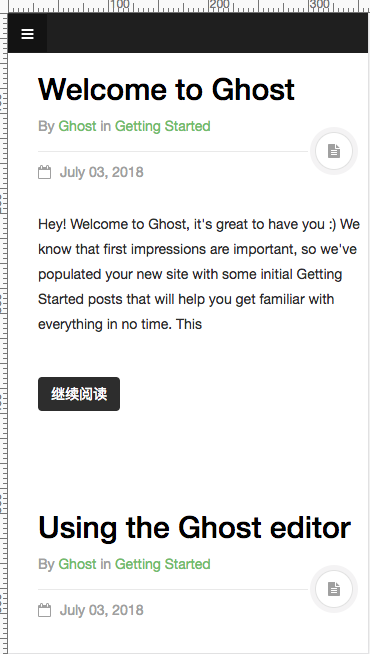

# ghostdrip
Ghost 主题

 预览图 
 
###目录架构###

```
├── /assets
|   ├── /css
|   ├── /fonts
|   ├── /images
|   ├── /js
├── /partials  
├── default.hbs
├── index.hbs [必需]
├── post.hbs [必需]
├── page.hbs
├── tag.hbs
└── author.hbs
```

*	`index.hbs` 和 `post.hbs` 是必须的 – 如果这两个模板文件不存在的话，Ghost就无法正常运行
*	`page.hbs` 独立页面模板 --/contact 可以自定义为 page-contact.hbs
*	`tag.hbs`  标签页面模板
*	`author.hbs` 作者页面模板
*	`partials` 是一个特殊的目录。 这个目录包含模板文件
*	`assets` 是一个资源的目录。 这个目录包含资源文件


####default.hbs####
基础模板，包含了所有需要出现在每个页面的HTML代码

####index.hbs####
首页的模板文件

####post.hbs####
单篇文章的模板文件


###全局设置###
通过`@blog`全局数据存取器，Ghost主题可以使用许多全局设置。
*	`{{@blog.url}}` – 在config.js文件中当前环境（配置文件分开发环境和生产环境）下指定的网址
*	`{{@blog.title}}` – 设置页面中的博客标题
*	`{{@blog.description}}` – 设置页面中的博客描述
*	`{{@blog.logo}}` – 设置页面中的博客logo


###文章###
无论是通过使用`foreach`遍历文章列表或者在`post.hbs`内部,可以获取文章信息：
*	`{{id}}`– 文章id
*	`{{title}}`  – 文章标题
*	`{{url}}` – 文章的相对路径
*	`{{content}}` – 文章的HTML
*	`{{published_at}}` – 文章的发布日期
*	`{{author}}` – 作者的详细信息

####作者信息####
在单篇文章的情况下，可以作者信息：
*	`{{author.name}}` – 作者的姓名
*	`{{author.email}}` – 作者的Email地址
*	`{{author.bio}}` – 作者的自我简介
*	`{{author.website}}` – 作者的网址
*	`{{author.image}}` – 作者的个人头像
*	`{{author.cover}}` – 作者的背景图像

####文章标签####
在单篇文章的情况下，可以文章标签信息：
*	`{{tag.name}}` – 标签的名称
*	`{{tags}}`来输出一排以逗号分隔的标签，或者使用`{{tags separator=""}}`来指定分隔符

####文章的SEO优化信息####
*	`{{meta_title}}`文章标题
*	`{{meta_description}}`文章描述


